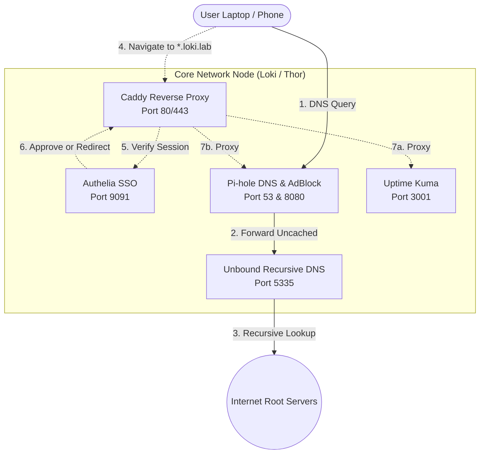

# Core Network Infrastructure

This repository manages the "Core Network" for the homelab. It sits completely independent of the media applications to ensure that DNS, ad-blocking, and monitoring are highly available.

## Services Included
- **Pi-hole (v6):** Network-wide ad-blocking and local DNS.
- **Unbound:** Recursive, privacy-first root DNS resolver. Bypasses the ISP completely.
- **Uptime Kuma:** Self-hosted monitoring dashboard for network uptime.
- **Authelia:** Enterprise-grade Single Sign-On (SSO) and Two-Factor Authentication (2FA) provider.
- **Caddy:** Reverse proxy acting as the front door, enforcing SSO authentication on all services.

---

## The Architecture (SSO & Reverse Proxy)

To provide a premium, secure experience, all services are hidden behind a reverse proxy (Caddy) and protected by Single Sign-On (Authelia).



1. **Local DNS:** Pi-hole resolves custom local domains (e.g., `pihole.loki.lab`, `kuma.loki.lab`, `auth.loki.lab`) directly to the server's IP.
2. **The Front Door:** Caddy listens on port 80/443. When a user navigates to `kuma.loki.lab`, Caddy intercepts the request.
3. **The Bouncer:** Caddy passes the request to Authelia (via Forward Auth). 
4. **Authentication:** 
    - If the user is unauthenticated, they are redirected to `auth.loki.lab` to log in.
    - If authenticated, Caddy proxies the request to the internal application (e.g., Uptime Kuma on port 3001).

*(Note: Uptime Kuma API routes are specifically bypassed in `configuration.yml` so that it can monitor itself without hitting the SSO wall).*

---

## Hardware Nodes
The core DNS stack runs on dedicated, low-power hardware to ensure it never goes down when the primary application servers restart.
*   **Thor:** HP 2000 Notebook PC (AMD E-350)
*   **Loki:** Compaq CQ58 Notebook PC (AMD C-60)

## Deployment

To deploy or update the stack on a node:
```bash
cd dns-stack
docker compose up -d
```
